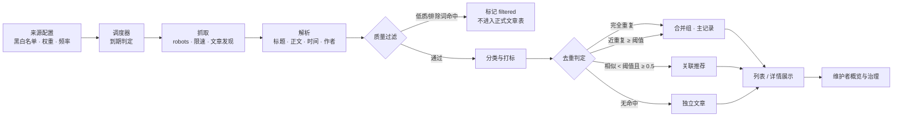

# AI 博客聚合站 · ai-blog-aggregator

[](https://github.com/zyx2531322466-blip/ai-blog-aggregator/actions/workflows/ci.yml)


自动抓取多个技术博客，完成**解析清洗 → 低质过滤 → 自动分类打标 → 跨来源去重与事件关联 → 统一浏览**，
并为维护者提供**来源配置、类别治理、去重策略审计与效果概览**的一站式后台。

> 设计原则：**"误合并比漏合并更严重"**——去重默认保守，宁可不合，也不错合；所有判定都保留可追溯的记录。

---

## 目录

- [核心能力](#核心能力)
- [技术栈](#技术栈)
- [系统流程](#系统流程)
- [目录结构](#目录结构)
- [快速开始](#快速开始)
- [环境变量](#环境变量)
- [接口一览](#接口一览)
- [核心规则说明](#核心规则说明)
- [数据模型](#数据模型)
- [测试与质量门槛](#测试与质量门槛)
- [CI](#ci)
- [常见问题](#常见问题)
- [项目文档](#项目文档)
- [抓取合规说明](#抓取合规说明)

---

## 核心能力

| 领域 | 能力 |
| --- | --- |
| 来源管理 | 主题/关注领域配置，来源黑/白名单，权重与更新频率（高频 3h / 普通 24h / 低频 7d / 自定义） |
| 采集 | 遵守 `robots.txt`、礼貌限速、同域文章发现、原始 HTML 留存、失败不中断批次 |
| 解析 | 标题/正文/发布时间/作者抽取，支持 Open Graph、`<article>`、JSON-LD 等多种页面结构 |
| 质量控制 | 排除词命中、广告话术、导航/聚合页（链接密度）、内容过短等低质内容过滤 |
| 分类与标签 | 受控类别体系 + 关键词权重打分，多标签，无法归类的落入"其他"并标记为未分类 |
| 去重与关联 | SHA-256 完全重复识别、SimHash 近重复识别（阈值可调）、同事件不同视角文章关联推荐 |
| 合并治理 | 合并组全部来源与原文链接展示、主记录按优先级自动选择与失效切换、可回滚的策略审计 |
| 浏览 | 文章列表（分类/来源/标签/日期筛选 + 分页）、详情页（全部来源、发布时间与采集时间、关联推荐） |
| 维护者后台 | 效果概览（分类分布、三类去重命中统计）、来源配置、类别管理、去重策略管理入口 |
| 访问控制 | 维护者 Bearer Token 单令牌模型（非用户账户体系），统一错误响应格式 |

---

## 技术栈

**后端**：Python 3.10 · FastAPI · SQLAlchemy 2.0（`Mapped` 类型化映射）· Alembic · Pydantic v2 · pydantic-settings · httpx · BeautifulSoup4/lxml

**数据**：SQLite（本地与测试默认）· PostgreSQL 16（Docker/生产）· Redis 7（预留）

**前端**：React 18 · TypeScript 5 · Vite 5 · Tailwind CSS 3 · react-router-dom 6 · Vitest + Testing Library

**工程化**：black / flake8 / pytest + pytest-cov（后端），eslint / prettier / tsc / vitest（前端），GitHub Actions CI，Docker Compose

---

## 系统流程



单位来源的一次处理流程封装在 `app/services/pipeline_service.process_source`（抓取 → 解析 → 过滤 → 分类 → 去重），
由调度器 `app/services/scheduler_service.run_due_sources` 按各来源频率周期触发。

---

## 目录结构

```
.
├── backend/                    # FastAPI 后端
│   ├── app/
│   │   ├── api/v1/             # 公开接口 + 维护者 admin 接口
│   │   ├── classifier/         # 关键词分类规则
│   │   ├── core/               # 配置、统一错误、鉴权
│   │   ├── crawler/            # 抓取器、robots、限速、文章发现、采集服务
│   │   ├── db/                 # 模型、枚举、会话、迁移基类
│   │   ├── dedup/              # 指纹、SimHash、主记录选择规则
│   │   ├── filtering/          # 低质量/不相关内容过滤
│   │   ├── parser/             # HTML 正文与元信息解析
│   │   ├── scheduler/          # 更新频率档位与到期判定
│   │   ├── schemas/            # Pydantic 请求/响应模型
│   │   └── services/           # 业务编排（文章/类别/来源/去重/概览/调度/流水线）
│   ├── alembic/                # 数据库迁移
│   ├── tests/                  # pytest 测试（含 HTML fixture，绝不访问真实网络）
│   ├── Dockerfile
│   └── requirements*.txt
├── frontend/                   # React + TypeScript + Tailwind 前端
│   ├── src/
│   │   ├── api/                # 接口封装与类型
│   │   ├── components/         # 卡片、筛选、分页、来源新鲜度等
│   │   └── pages/              # 列表页、详情页、维护者概览页
│   ├── nginx.conf              # 生产静态资源 + /api 反向代理
│   └── Dockerfile
├── infra/
│   ├── docker-compose.yml      # db(PostgreSQL) + redis + api + web
│   └── .env.example
├── .github/workflows/ci.yml    # 后端 / 前端 / 基础设施三段式 CI
├── constitution.md             # 项目治理原则（最高优先级）
├── spec.md                     # 需求规格
├── plan.md                     # 技术方案
├── tasks.md                    # 任务拆解
├── tickets.md                  # T01–T21 逐票实现说明
└── README.md
```

---

## 快速开始

### 方式一：Docker Compose（推荐）

```bash
cp infra/.env.example infra/.env      # 按需修改端口/令牌
docker compose -f infra/docker-compose.yml up --build
```

启动后：

- 前端：<http://localhost:3000>
- 后端 API：<http://localhost:8000>，交互式文档 <http://localhost:8000/docs>
- 健康探针：<http://localhost:8000/healthz>

`api` 容器启动时会先执行 `alembic upgrade head` 完成数据库迁移，再启动服务。

### 方式二：本地开发

**后端（默认 SQLite，无需外部数据库）**

```bash
cd backend
python -m venv .venv && source .venv/bin/activate   # Windows: .venv\Scripts\activate
python -m pip install -r requirements-dev.txt
mkdir -p data                                       # SQLite 文件目录
alembic upgrade head                                # 初始化表结构
APP_ADMIN_TOKEN=dev-token uvicorn app.main:app --reload
```

**前端**

```bash
cd frontend
npm install
npm run dev            # http://localhost:5173，/api 默认代理到 http://localhost:8000
```

如需代理到其他后端地址：`VITE_API_PROXY_TARGET=http://localhost:9000 npm run dev`。

### 冒烟验证

```bash
curl http://localhost:8000/healthz
curl http://localhost:8000/api/v1/articles
curl -H "Authorization: Bearer dev-token" http://localhost:8000/api/v1/admin/insights
```

---

## 环境变量

后端配置统一使用 `APP_` 前缀（`backend/app/core/config.py`），可通过环境变量或 `backend/.env` 注入：

| 变量 | 默认值 | 说明 |
| --- | --- | --- |
| `APP_APP_NAME` | `Blog Aggregator` | 应用名称（OpenAPI 标题） |
| `APP_ENVIRONMENT` | `development` | `test` 时跳过默认类别初始化（避免污染测试库） |
| `APP_API_V1_PREFIX` | `/api/v1` | 接口前缀 |
| `APP_DATABASE_URL` | `sqlite:///./data/app.db` | 数据库连接串；生产用 `postgresql+psycopg2://...` |
| `APP_REDIS_URL` | `redis://localhost:6379/0` | Redis 连接串（预留） |
| `APP_ADMIN_TOKEN` | `change-me-in-production` | **维护者令牌，生产必须替换为强随机值** |
| `APP_ADMIN_ACTOR` | `admin` | 变更审计中记录的"谁" |
| `APP_CORS_ORIGINS` | `["http://localhost:5173","http://localhost:3000"]` | 允许的前端来源 |
| `APP_CRAWLER_USER_AGENT` | `BlogAggregatorBot/0.1 (...)` | 爬虫 UA，建议替换为可联系到你的信息 |
| `APP_CRAWLER_TIMEOUT_SECONDS` | `10.0` | 单次请求超时 |
| `APP_CRAWLER_MIN_INTERVAL_SECONDS` | `1.0` | 单站最小请求间隔（礼貌限速） |
| `APP_CRAWLER_MAX_PAGES_PER_RUN` | `20` | 单次调度单站最大抓取页数 |

容器编排相关变量见 `infra/.env.example`（`POSTGRES_*`、`APP_ADMIN_TOKEN`、`PIP_INDEX_URL` 等）。

---

## 接口一览

### 公开接口（匿名访问）

| 方法 | 路径 | 说明 |
| --- | --- | --- |
| `GET` | `/healthz` | 健康探针 |
| `GET` | `/api/v1/articles` | 文章列表：`category`、`source_id`、`tag`、`date_from`、`date_to`、`page`、`page_size` |
| `GET` | `/api/v1/articles/{id}` | 文章详情：合并组全部来源、关联推荐、发布时间与采集时间 |
| `GET` | `/api/v1/categories` | 启用中的受控类别及文章数 |
| `GET` | `/api/v1/sources` | 来源维度新鲜度（最后成功更新时间 / 最后抓取时间） |

### 维护者接口（`Authorization: Bearer <APP_ADMIN_TOKEN>`）

| 方法 | 路径 | 说明 |
| --- | --- | --- |
| `GET` | `/api/v1/admin/ping` | 令牌连通性检查 |
| `GET/POST` | `/api/v1/admin/sources` | 来源列表 / 新建（含主题、关键词、黑白名单、权重、频率） |
| `GET/PATCH` | `/api/v1/admin/sources/{id}` | 查看 / 编辑来源配置 |
| `GET` | `/api/v1/admin/sources/frequency-tiers` | 建议更新频率档位（高频/普通/低频） |
| `GET/POST` | `/api/v1/admin/categories` | 类别列表 / 新建 |
| `PATCH` | `/api/v1/admin/categories/{id}` | 类别改名 |
| `POST` | `/api/v1/admin/categories/{id}/merge` | 类别合并 |
| `POST` | `/api/v1/admin/categories/{id}/status` | 类别启用 / 停用 |
| `GET` | `/api/v1/admin/categories/{id}/history` | 类别变更历史 |
| `POST` | `/api/v1/admin/articles/{id}/category` | 文章重新归类 |
| `POST` | `/api/v1/admin/articles/{id}/inaccessible` | 标记原文不可访问并触发主记录切换 |
| `GET/PATCH` | `/api/v1/admin/dedup/settings` | 查看 / 调整近重复阈值（默认 0.90） |
| `GET` | `/api/v1/admin/dedup/history` | 阈值变更记录 |
| `POST` | `/api/v1/admin/dedup/rollback` | 回滚到指定变更记录 |
| `POST` | `/api/v1/admin/dedup/preview` | 阈值变更预览（将新增合并 / 拆分 / 新增关联） |
| `GET` | `/api/v1/admin/dedup/hits` | 去重命中记录（完全重复 / 近重复 / 关联，含依据与来源） |
| `GET` | `/api/v1/admin/dedup/groups` | 合并组主记录与全部成员 |
| `POST` | `/api/v1/admin/dedup/groups/refresh` | 重新应用主记录选择规则（检测失效并切换） |
| `POST` | `/api/v1/admin/dedup/groups/{key}/refresh` | 刷新指定合并组主记录 |
| `GET` | `/api/v1/admin/insights` | 分类分布 + 去重命中统计 |

所有错误响应统一为：

```json
{ "error": { "code": "NOT_FOUND", "message": "文章不存在", "details": null } }
```

---

## 核心规则说明

### 内容质量过滤（`app/filtering`）

按顺序判定，命中即标记为 `filtered`（保留原始记录用于审计，但所有面向用户的查询都会排除）：

1. 正文过短（< 10 字符，疑似非文章页）；
2. 命中来源配置的**排除词**；
3. 标题含"首页/导航/目录/404"等占位特征且正文偏短；
4. 命中 ≥ 2 个广告/营销话术（立即购买、限时优惠、扫码关注…）；
5. 链接文本占比 ≥ 50%（纯导航/聚合页）。

### 分类与标签（`app/classifier`）

- 受控类别由维护者维护，初始预置 7 个默认类别；
- 关键词打分：**标题权重 3 / 正文权重 1**，取最高分类别；
- 无任何命中时落入"其他"并标记为**未分类**，维护者可一键重新归类。

### 去重与关联（`app/dedup`）

| 判定 | 方法 | 默认阈值 | 处理 |
| --- | --- | --- | --- |
| 完全重复 | 正文规范化（NFKC + 空白折叠）后的 SHA-256 指纹 | 精确相等 | 合并为同一合并组 |
| 近重复 | 64 位 SimHash，相似度 = `1 − 汉明距离 / 64` | **0.90**（可配置） | 合并为同一合并组 |
| 关联推荐 | 同上相似度，高于下限但不达合并阈值 | **0.50** | 不合并，仅互相推荐 |

- 阈值提高会让原本合并的文章**拆分**，降低会让更多文章**合并**；
- 每次调整都会写入变更历史（旧值/新值/操作者/时间），支持一键回滚；
- 调整前可先调用预览接口查看"将新增合并 / 将拆分 / 将新增关联"的清单；
- 同一对文章若被判定为合并，则原有的关联关系会被移除（合并优先级高于关联）。

### 主记录选择（`app/dedup/primary.py`）

合并组展示的主记录按以下优先级选出：

1. 来源权威权重（高者优先）
2. 发布时间最早
3. 内容完整度（正文更长者优先）
4. 原文可访问性

> 只要组内仍有**可访问**的来源，就只在可访问成员中评选，因此主记录原文失效时会自动切换到组内其他有效来源；
> 完全并列时按创建时间、再按 ID 兜底，保证结果稳定可复现。
> 详情页始终展示**全部来源**及其原文链接，而不仅展示主记录。

### 更新调度（`app/scheduler`）

| 档位 | 默认间隔 |
| --- | --- |
| 高频 | 3 小时 |
| 普通（未配置时的默认值） | 24 小时 |
| 低频 | 7 天 |
| 自定义 | 由来源的 `update_interval_seconds` 指定 |

调度器仅处理**启用中且非黑名单**的来源；重复触发依赖指纹/合并记录的幂等性，不会产生重复文章或重复关系。

---

## 数据模型

核心表（`backend/app/db/models.py`，迁移见 `backend/alembic/versions/`）：

| 表 | 作用 |
| --- | --- |
| `sources` | 来源/关注领域：站点、黑白名单、权重、频率、最后抓取与最后成功时间 |
| `categories` / `category_history` | 受控类别及其变更（新建/改名/合并/停用）审计 |
| `articles` | 文章：标题、正文、摘要、指纹、SimHash、类别、状态、发布时间、采集时间、可访问性 |
| `tags` / `article_tags` | 标签与文章多对多 |
| `duplicate_relations` | 合并组与关系：类型（完全重复/近重复/关联）、主记录标记、相似度、判定依据 |
| `crawl_pages` | 原始抓取页面，按 `(source_id, url)` 幂等 |
| `dedup_settings` / `dedup_setting_history` | 去重阈值当前值与变更/回滚历史 |

主键均为带前缀的字符串 ID（如 `article_…`、`source_…`），便于日志排查与跨环境迁移。

---

## 测试与质量门槛

```bash
# 后端：格式 + 静态检查 + 测试（含覆盖率，CI 门槛 85%）
cd backend && black --check . && flake8 . && pytest

# 前端：静态检查 + 格式 + 类型检查/构建 + 单测
cd frontend && npm run lint && npm run format:check && npm run build && npm test
```

当前状态：

- 后端 **189** 个测试全部通过，`app` 覆盖率 **≈95%**（`pytest --cov-fail-under=85`）；
- 前端 **19** 个测试全部通过，eslint / prettier / `tsc --noEmit` 均无告警；
- 爬虫与解析测试全部使用 `backend/tests/fixtures/*.html` 录制样本，**不访问真实网络**；
- `tests/test_e2e.py` 覆盖七类端到端场景：正常采集展示、完全重复合并、近重复合并、不同视角关联、
  未分类兜底与重新归类、主记录切换、阈值调整审计。

---

## CI

`.github/workflows/ci.yml` 在每次 push / PR 触发三个作业：

1. **Backend**：`black --check` → `flake8` → `pytest --cov-fail-under=85`；
2. **Frontend**：`eslint` → `prettier --check` → `tsc + vite build` → `vitest`；
3. **Infra**：`docker compose config -q` 校验编排文件。

---

## 常见问题

**Q：为什么本地默认用 SQLite，容器里却是 PostgreSQL？**
A：本地/测试追求零依赖；生产用 PostgreSQL 以获得更好的并发与运维能力。业务代码通过 SQLAlchemy 2.0 统一抽象，
并对 SQLite/PostgreSQL 的差异做了处理（如 SimHash 以有符号 64 位存储、Alembic 开启 batch 模式）。

**Q：维护者接口返回 401？**
A：需要 `Authorization: Bearer <APP_ADMIN_TOKEN>`。默认令牌为 `change-me-in-production`，本地可通过环境变量覆盖；
前端 `/admin` 页面提供一个令牌输入框用于加载概览。

**Q：抓取到重复文章怎么办？**
A：先看 `/api/v1/admin/dedup/hits` 与 `/api/v1/admin/dedup/groups` 的判定依据；
若判定过激，可在 `/api/v1/admin/dedup/preview` 预览后调高阈值；若漏判严重则调低阈值，历史记录支持回滚。

**Q：`data/app.db` 或依赖目录被提交了吗？**
A：没有。`.gitignore` 已排除 `data/`、`*.db`、`node_modules/`、`dist/`、`__pycache__/`、`.env` 等本地产物。

---

## 项目文档

| 文档 | 内容 |
| --- | --- |
| [`constitution.md`](constitution.md) | 项目治理原则（最高优先级，约束实现与评审） |
| [`spec.md`](spec.md) | 需求规格与用户故事 1–9 |
| [`plan.md`](plan.md) | 技术方案与架构决策 |
| [`tasks.md`](tasks.md) | 任务拆解与优先级 |
| [`tickets.md`](tickets.md) | **T01–T21** 逐票实现说明（依赖顺序、验收标准、边界） |

---

## 抓取合规说明

- 抓取前检查目标站点 `robots.txt`，被拒绝的路径不会访问；
- 遵循单站最小请求间隔，避免对目标站点造成压力；
- 仅用于个人学习与研究用途的内容聚合；请在部署前确认目标站点的服务条款与版权要求，
  并自行承担合规责任。生产部署时请将 `APP_CRAWLER_USER_AGENT` 替换为可联系到运营者的标识。
