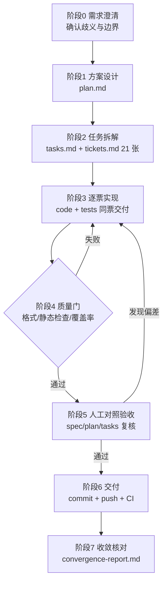

# AI 协作开发流程（AI-Assisted Delivery Process）

> **适用范围**：本项目（AI 博客聚合站，T01–T21）从需求澄清到交付验收的全过程
> **基线**：`main @ 9b150e8`　**形态**：人机结对（Human-in-the-loop），AI 产出实现与证据，人负责验收与决策
> **一句话概括**：**以文档为唯一事实来源，以票据为最小交付单元，以自动化测试为证据，以人工对照为收敛判据。**

---

## 1. 目标与原则

| 原则 | 落地方式 |
| --- | --- |
| 单一事实来源 | 需求/计划/拆解/票据全部入库（`spec.md`、`plan.md`、`tasks.md`、`tickets.md`），代码与文档同仓库同版本 |
| 小步可验证 | 每张票据是一个可独立验收的最小单元，实现与测试同票交付 |
| 证据优先 | 一切"完成"必须附可复现证据（测试用例、覆盖率、CI 结论），不接受口头完成 |
| 人类保留决策权 | 需求边界、验收判定、优先级、安全与发布决策由人做出，AI 只提方案与实现 |
| 偏差显式化 | 任何"文档与实现不一致"都必须登记、分类、关闭，不允许静默漂移 |
| 变更可追溯 | 每次交付对应一次提交，偏差与决策记录在案（见 `docs/convergence-report.md`） |

---

## 2. 协作模型与职责边界

| 环节 | AI 承担 | 人类承担 |
| --- | --- | --- |
| 需求澄清 | 归纳歧义点、给出候选方案与影响面 | **拍板**需求边界、非目标与验收标准 |
| 方案设计 | 输出模块划分、数据模型、接口契约 | 评审架构取舍与风险 |
| 编码实现 | 全部业务代码、迁移脚本、前端页面 | 抽查关键逻辑、关注安全与合规 |
| 测试 | 单元/集成/端到端用例，含 fixture 录制 | 确认测试是否对得上验收标准 |
| 质量门 | 本地跑格式/静态检查/覆盖率，修复失败 | 决定门槛值（如覆盖率 85%） |
| 偏差管理 | 记录偏差、给出修正方案并实施 | 判定是"改代码"还是"改文档" |
| 交付 | 提交、推送、CI 验证、缺陷复盘 | 最终验收与发布 |

> 关键约定：**AI 不自我验收**。每张票据完成后由人对照 `spec/plan/tasks/tickets` 复核，发现出入即回退到实现阶段。

---

## 3. 治理与制品链（Documentation Chain）

```
constitution.md   治理原则（最高约束：可读性 / 模块化 / 测试分层 / 界面一致 / 性能 / 依赖锁定 / 访问控制）
      │ 约束
spec.md           需求规格：用户故事 1–9 + 功能需求 + 非目标
      │ 拆解
plan.md           技术方案：架构、技术选型、数据与算法决策
      │ 排序
tasks.md          任务与优先级（明确依赖关系）
      │ 细化为可验收单元
tickets.md        21 张票据：依赖顺序 + 验收标准 + 明确"不包含"的边界
      │ 实现
code + tests      实现与其证据
      │ 核对
docs/convergence-report.md   收敛报告（逐票对照 + 偏差登记 + 未收敛项）
```

**为什么要有"不包含"**：每张票据同时写明"不做什么"，使"完成"有客观判据，避免范围蔓延（例：T20 只做概览，不重做 T04/T07/T15 的子管理功能）。

---

## 4. 工作流（阶段与门禁）



| 阶段 | 输入 | 输出（制品） | 门禁（Exit Criteria） |
| --- | --- | --- | --- |
| 0 澄清 | 原始需求 | 澄清问题清单、已确认结论 | 歧义项全部有明确答复并写入文档 |
| 1 设计 | `spec.md` | `plan.md` | 方案覆盖全部功能需求，技术选型有理由 |
| 2 拆解 | `plan.md` | `tasks.md`、`tickets.md` | 每票含依赖、验收标准、"不包含" |
| 3 实现 | 单张票据 | 代码 + 测试 + 迁移 | 验收标准逐条落地，测试覆盖验收点 |
| 4 质量门 | 代码 | 质量报告 | `black --check`、`flake8`、`pytest --cov-fail-under=85`、`eslint`、`prettier --check`、`tsc`、`vitest` 全绿 |
| 5 验收 | 实现 + 文档 | 差异清单 | 人工对照无未解释差异（或已登记偏差） |
| 6 交付 | 变更集 | commit / push / CI 结论 | CI 三作业通过 |
| 7 收敛核对 | 全部制品 | 收敛报告 | 逐票对照闭合、偏差关闭、范围外事项登记 |

---

## 5. 单票执行循环（可复用的工作单元）

```
读票（验收标准 + 边界 + 依赖）
  → 设计（模块/数据模型/接口契约）
    → 实现 + 同票编写测试
      → 本地质量门（后端 pytest/black/flake8；前端 vitest/lint/build）
        → 汇报（交付物、证据、遗留问题）
          → 人工对照 spec/plan/tasks
            → 通过则下一票；有偏差则回到实现
```

**Definition of Done（每票检查清单）**

- [ ] 验收标准**逐条**有对应实现，且能指出代码位置
- [ ] 每条验收标准至少有一个自动化用例；边界条件有负向用例
- [ ] 新增/变更的数据结构有 Alembic 迁移（前后可升级/降级）
- [ ] 通过统一质量门，覆盖率不低于门槛
- [ ] 不引入真实网络依赖（测试用 fixture / 假抓取器）
- [ ] 文档（README / 接口一览 / 使用说明）同步更新
- [ ] 遗留事项显式登记（不留在脑子里）

---

## 6. 质量门与度量

CI（`.github/workflows/ci.yml`）在每次 push / PR 触发三个作业，全部通过才算交付：

| 作业 | 内容 | 失败即阻断 |
| --- | --- | --- |
| Backend | `black --check` → `flake8` → `pytest --cov-fail-under=85` | ✅ |
| Frontend | `eslint --max-warnings 0` → `prettier --check` → `tsc --noEmit + vite build` → `vitest` | ✅ |
| Infra | `docker compose config -q` | ✅ |

当前度量（基线 `9b150e8`，与收敛报告一致）：

| 指标 | 数值 |
| --- | --- |
| 后端用例 / 覆盖率 | 207 passed / **95%**（门槛 85%） |
| 前端用例 / 文件 | 19 passed / 6 |
| 核心逻辑覆盖率 | 去重 96–100%、分类 100%、过滤 94%、抓取编排 99% |
| 数据库迁移 / HTTP 业务端点 | 4 / 29（公开 4 + 维护者 25） |
| 代码规模 | 后端 `app` 5,462 行、测试 4,508 行、前端 `src` 1,163 行 |
| CI 运行 | 最近 5 次全部 success |

---

## 7. 变更与偏差管理

**偏差分类**（三类，处理路径不同）：

| 类型 | 含义 | 处理 |
| --- | --- | --- |
| A 文档 ↔ 实现不一致 | 文档承诺了未实现的行为 | 二选一：补实现，或修正文档并登记为范围外 |
| B 需求边界 / 语义冲突 | 两条要求相互矛盾（如"权重优先"与"失效即切换"） | 明确语义写入实现与文档，人工拍板 |
| C 实跑暴露的缺陷 | 单元测试全绿但真实运行失败 | 视为最高优先级，补回归用例后修复 |

**登记方式**：统一记录在 `docs/convergence-report.md` 的偏差表（编号 D-01…、现象、处理、对应提交），
关闭标准是"有修复提交 + 有回归用例 + CI 通过"。

**典型案例（说明流程有效）**：为了给站点填充真实内容而执行真实抓取时，暴露了三个单元测试无法发现的缺陷 →
`crawl_pages` 并发写竞态、单来源失败中断整轮调度、站点 `<h1>` 为站名导致标题错。
它们被登记为 C 类偏差，修复后各补了回归用例（含用 monkeypatch 复现竞态的确定性测试）。

---

## 8. 可复现性与工程约束

| 约束 | 落地 |
| --- | --- |
| 依赖锁定 | `requirements.txt` / `requirements-dev.txt` 精确版本；前端 `package-lock.json` + `npm ci` |
| 测试不触网 | 录制 HTML fixture（`backend/tests/fixtures/`）+ `StaticFetcher` / `RaisingFetcher` |
| 边界可注入 | 网络（`Fetcher`）、数据库（`dependency_overrides`）、分类器（`Classifier`）均可替换 |
| 一键启动 | `docker compose -f infra/docker-compose.yml up -d --build`（容器启动自动执行迁移） |
| 一键复核 | `black --check` + `flake8` + `pytest --cov-fail-under=85`；前端 lint/format/build/test |
| 演示数据可复现 | `python -m app.scripts.seed_sources`（12 个热门博客，幂等 + `--dry-run`） |
| 跨平台 | 无平台相关 API；文档给出 Windows / Linux / macOS 三套命令 |

---

## 9. 可复用的实践要点（Checklist）

1. **先立规矩再写代码**：把治理原则（可读性/测试/依赖/访问控制）固化成文档并在每票执行。
2. **票据必须可验收**：写清依赖、验收标准、**不包含**；一张票只解决一件事。
3. **测试与实现同票交付**：测试是交付物的一部分，不是后续补的。
4. **反向验证优先**：先写"什么情况必须失败"的用例（黑名单、robots 拒绝、阈值边界、并发冲突）。
5. **把"跑起来"当作验收前置**：单元测试全绿 ≠ 端到端可用；真实数据是发现缺陷的最快途径。
6. **让机器守门**：格式/静态检查/覆盖率交给 CI，人只看业务与风险。
7. **偏差显式登记**：任何"文档与实现不一致"都编号、分类、关闭，形成可审计链路。
8. **范围外事项要留痕**：明确列出未做的与原因，比"以为做了"安全得多。
9. **可复现的数据路径**：种子脚本 + 幂等设计，让任何人都能重建演示环境。
10. **结论可被复核**：最终以一份收敛报告给出逐票对照与命令，任何人可本地复现。

---

## 10. 度量与时间线

| 提交 | 时间 | 内容 |
| --- | --- | --- |
| `57c67cf` | 2026-09-11 16:16 | 首版实现（T01–T21）+ 首版文档 |
| `2ad0576` | 16:17 | CI 升级（actions v5 / Node 22），清除弃用告警 |
| `029e1f9` | 16:32 | README 增加"网站使用说明"与"AI 开发过程" |
| `7e27dca` | 16:50 | 使用说明按 Windows/Linux/macOS 分系统，声明支持范围 |
| `9b150e8` | 23:58 | 内容质量修复 + 热门博客种子来源 + 分享指南（含 6 项 C 类缺陷修复） |

---

## 11. 局限与改进方向

| 局限 | 说明 | 改进方向 |
| --- | --- | --- |
| 验收依赖人工 | 无自动化"收敛检测"，C1/C4 由人判断（本报告的偏差表即为补偿机制） | 引入需求-用例双向追溯矩阵（如把票据编号写进测试 docstring 并自动生成覆盖矩阵） |
| 平台验证不完整 | Windows（本机）与 Linux（CI）已验证，**macOS 未纳入 CI** | CI 增加 `macos-latest` 矩阵 |
| 覆盖率是"行覆盖" | 不代表语义完整性 | 对去重/分类补充性质测试与样本回归集 |
| 阈值标定样本有限 | SimHash 阈值基于少量样本（转载 0.906 / 改写 0.625） | 用真实抓取数据持续校准并留存评估集 |
| AI 产出需审阅 | 存在"看似合理"的实现风险 | 关键路径强制人工 Code Review，安全项（令牌/权限）双人确认 |

---

## 12. 附录：制品清单与命令速查

| 制品 | 路径 | 作用 |
| --- | --- | --- |
| 治理原则 | `constitution.md` | 最高约束 |
| 需求 / 方案 / 任务 / 票据 | `spec.md` / `plan.md` / `tasks.md` / `tickets.md` | 需求链与 21 张可验收票据 |
| 收敛报告 | `docs/convergence-report.md` | 逐票对照 + 偏差登记 + 未收敛项 |
| 分享指南 | `docs/sharing-guide.md` | 让其他人访问站点（局域网/临时公网/长期部署） |
| 入口说明 | `README.md` | 功能、接口、使用说明、开发过程概览 |
| 种子来源 | `backend/app/scripts/seed_sources.py` | 一键写入 12 个热门技术博客 |

```bash
# 质量门（Linux / macOS / Windows Git Bash）
cd backend  && black --check . && flake8 . && pytest --cov-fail-under=85
cd frontend && npm run lint && npm run format:check && npm run build && npm test

# 启动与造数据
docker compose -f infra/docker-compose.yml up -d --build
docker compose -f infra/docker-compose.yml exec api python -m app.scripts.seed_sources
docker compose -f infra/docker-compose.yml exec api python -c "from app.db.session import get_session_factory as f; from app.services import scheduler_service as s; db=f()(); print(s.run_scheduler_tick(db)); db.close()"
```
